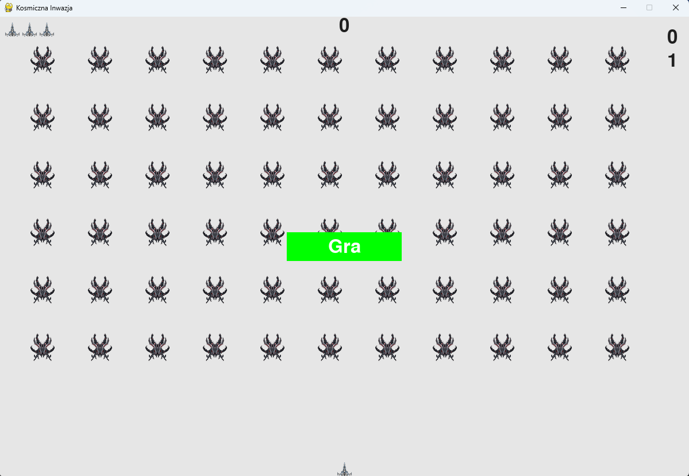

# Kosmiczna Inwazja

Kosmiczna Inwazja to klasyczna gra typu "Space Invaders" stworzona przy użyciu Pygame. Celem gry jest ochrona planety przed inwazją obcych statków kosmicznych. Gra oferuje rosnący poziom trudności, z każdym poziomem zwiększając prędkość przeciwników.

## Spis treści
- [Instalacja](#instalacja)
- [Uruchomienie](#uruchomienie)
- [Zasady gry](#zasady-gry)
- [Pliki](#pliki)
- [Kontrybucja](#kontrybucja)
- [Licencja](#licencja)

## Instalacja

Aby uruchomić grę, potrzebujesz zainstalowanego Pythona oraz biblioteki Pygame. Możesz je zainstalować za pomocą poniższych komend:

`pip install pygame`

Możesz też skorzystać z pliku requirements.txt

`pip install -r requirements.txt`

Następnie sklonuj to repozytorium na swój lokalny dysk:

`git clone https://github.com/twoj-uzytkownik/nazwa-repozytorium.git cd nazwa-repozytorium`

## Uruchomienie

Aby uruchomić grę, po prostu wykonaj poniższą komendę w terminalu, będąc w katalogu projektu:

`python space_invaders.py`

## Zasady gry

- Używaj klawiszy strzałek, aby poruszać swoim statkiem w lewo i prawo.
- Naciśnij spację, aby wystrzelić pocisk.
- Zniszcz wszystkie obce statki, aby przejść do kolejnego poziomu.
- Każdy kolejny poziom zwiększa prędkość przeciwników.
- Gra kończy się, gdy wszystkie Twoje statki zostaną zniszczone lub gdy obcy dotrą do dolnej krawędzi ekranu.

## Pliki

### Główne pliki gry

- **space_invaders.py**: Główny plik uruchamiający grę.
- **settings.py**: Plik konfiguracyjny z ustawieniami gry.
- **game_functions.py**: Plik zawierający główne funkcje gry.
- **game_stats.py**: Plik zarządzający statystykami gry.
- **scoreboard.py**: Plik odpowiedzialny za wyświetlanie wyników.
- **button.py**: Plik definiujący przyciski w grze.
- **ship.py**: Plik zarządzający statkiem gracza.
- **bullet.py**: Plik zarządzający pociskami.
- **invader.py**: Plik zarządzający obcymi statkami.

### Zależności

- **pygame**: Biblioteka do tworzenia gier 2D.

## Kontrybucja

Jeśli chcesz przyczynić się do rozwoju tego projektu, otwórz zgłoszenie (issue) lub stwórz pull request. Zawsze mile widziane są nowe funkcje, poprawki błędów oraz optymalizacje kodu.

## Licencja

Projekt jest dostępny na licencji MIT. Szczegóły znajdują się w pliku LICENSE.